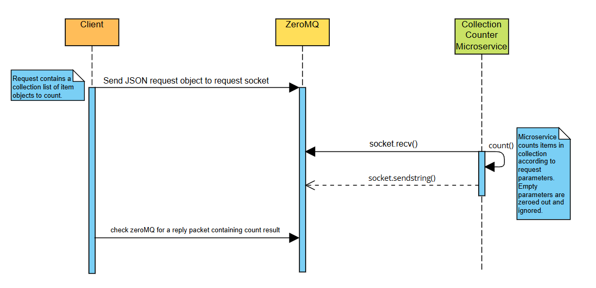

# CS_361_Collection_Counter_Microservice

# Setting Up Your Environment
1. Create a python virtual environment
    
    `python3 -m venv venv`
2. Activate your virtual environment (Different command on windows)

    `source venv/bin/activate`
3. Install Dependencies

    `pip install -r requirements.txt`
4. Run Program

    `python3 microservice.py`

# Request Data

Requests must be sent as `JSON strings` through a `ZeroMQ REQ Socket` properly connected to the microservice server.

`data` must be formatted as a JSON.

General format:
```
json
{
    "collection": [
        {
            "type": "exampleItem",
            "date": "01-01-2020",
            "tags": "new,blue,cool"
        },
        {
            "type": "exampleItem",
            "date": "11-02-2020",
            "tags": "red,cool"
        }
    ],
    "sort_by": "all | date_range | tag",
    "target_value": "value dependent on sort_by"
}
```
Request Implementation Example:
```
import zmq
import json

context = zmq.Context()
socket = context.socket(zmq.REQ)
socket.connect("tcp://*:5014")

data = {
    "collection": [
        {"type": "pic", "date": "09-01-2020", "tags": "homework,school"},
        {"type": "pic", "date": "10-02-2021", "tags": "school,fun"},
        {"type": "pic", "date": "10-03-2022", "tags": "homework,group_project,school"}
    ],
    "sort_by": "tag",
    "target_value": "school"
}

socket.send_string(json.dumps(data))
response = socket.recv()
```

# Request Parameters

- collection: List of objects with the following fields: 
  - type
  - date formatted as "MM-DD-YYYY"
  - tags (comma-separated string)
- sort_by: Determines which counting method is used.
  - "all" - count all items
  - "date_range" — count items within a date range
  - "tag" — count items containing a tag
- target_value: Depends on sort_by value.
  - If sort_by is "all": value is ignored.
  - If sort_by is "date_range": {"start_date": "MM-DD-YYYY", "end_date": "MM-DD-YYYY"}
  - If sort_by is "tag": value is desired tag string.

# Receive Data
To receive data, a client must:
1. Connect to the server via a REQ socket.

2. Send a properly formatted JSON string.

3. Wait for the response from the server.

4. Access count by calling response_data.get("count")

Example call:
```
import zmq
import json


context = zmq.Context()

socket = context.socket(zmq.REQ)

# Connect to the microservice
socket.connect("tcp://localhost:5014")  # replace localhost with server IP if remote

# Properly formatted request JSON
data = {
    "collection": [
        {"type": "pic", "date": "09-01-2020", "tags": "homework,school"},
        {"type": "pic", "date": "10-02-2021", "tags": "school,fun"},
        {"type": "pic", "date": "10-03-2022", "tags": "homework,group_project,school"}
    ],
    "sort_by": "tag",
    "target_value": "school"
}

# Send the request as a string
socket.send_string(json.dumps(data))

#---------------Receive the response---------------#
response = socket.recv()
response_data = json.loads(response.decode())

# Using result:
print("Number of items matching criteria:", response_data.get("count"))
```


# UML sequence diagram


